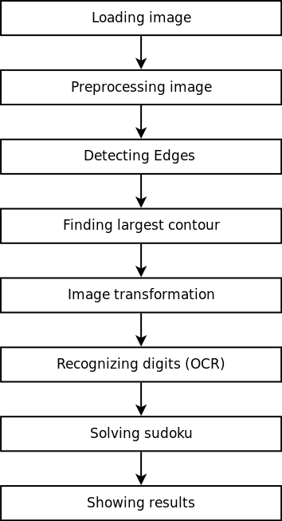

 Yet Another Sudoku Solver
=================================================
Solving sudoku with [Scala](http://www.scala-lang.org/), [JavaCV](https://github.com/bytedeco/javacv) (Image processing) and [DeepLearning4j](https://deeplearning4j.org/) (OCR) 

### Program execution steps: 

 

- Loading image from file in greyscale
- Using `Canny` for  edge detection
- Find largest contour among detected edges. We assume that sudoku grid will be the biggest object on the image
- Compute bounding rectangle and apply a perspective transformation to an image
- Apply `adaptiveTheshold` (image will become binary)
- Split image in 81 cell
- Filter cells, so that only those containing digits left
- Resize each cell image
- Pass each cell to neural network (2-layer MLP with `Adam` and `NegativeLogLikelihood`) for digit recognition
- Solving sudoku with `Constraint propagation`, afterward if not solved yet with `Backtracking` as described [here](http://norvig.com/sudoku.html)

